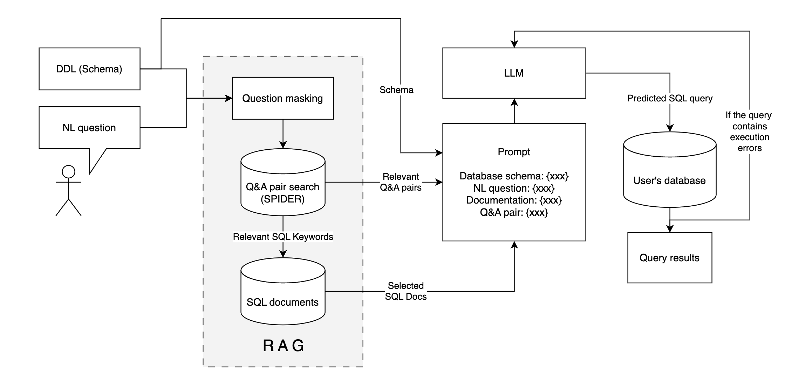

# Retrieval-Augmented-Generation-Enhanced Large Language Model for Text-to-SQL

This repository contains all the relevant codes for building a RAG enhanced LLM for Text-to-SQL,  evaluation data and also instructions on how to evaluate the performance by [test-suite-sql-eval](https://github.com/taoyds/test-suite-sql-eval) through Docker and customize your Text-to-SQL evaluation pipeline based on own data by [Langsmith](https://docs.smith.langchain.com/).

## Tech Stack


## Architecture
The text-to-SQL architecture, as shown in the figure below, receives two pivotal inputs: the user's natural language question and the database's Data Definition Language (DDL), which outlines the database's schema. The DDL plays a critical role, in equipping the Language Model (LLM) with the necessary context of the available tables and fields for formulating queries. The process commences with a Question Masking step that selectively conceals schema-specific keywords, thus preserving the integral framework of the question. This masked version then acts as a query to fetch the three most structurally similar question-and-answer pairs from a vector database. Retrieving these pairs facilitates the LLM in generating the SQL commands and accessing related documentation relevant to the user's question. Subsequently, a comprehensive prompt is crafted, integrating DDL, SQL Q&A pairs and documentation, which is presented to the LLM for SQL query generation. After the LLM generates the SQL query, it is executed within the user’s database. In the event of execution errors, the LLM is equipped with a self-corrective feature that allows for reiteration, refining the query until a successful execution is achieved.



## Play with the codes
Install relevant packages
```bash
git clone https://github.com/mruiyangyou/RAG-enhanced-LLM-Agent-for-text-to-SQL-generation.git
cd RAG-enhanced-LLM-Agent-for-text-to-SQL-generation
pip install -r requirements.txt
```
Prepare api keys:
1. OpenAI(Chat)
2. Cohere(rerank)
3. Pinecone(vectordb)
4. Langsmith(monitoring)
```bash
export LANGCHAIN_TRACING_V2="true"
export LANGCHAIN_ENDPOINT="https://api.smith.langchain.com"
export LANGCHAIN_API_KEY="xxx"
export LANGCHAIN_PROJECT="xxx"
export PINECONE_API_KEY="xxx"
export COHERE_API_KEY="xxx"
export OPENAI_API_KEY="xxx"
```
## Project Structure

### data
* [inventory](./data/inventory/): data for **inventory 50** mentioned in the report
* [sql_test_suite](./data/sql_test_suite/): data for **academic full** mentioned in the report
* [sql_test_suite_academic40](./data/sql_test_suite_academic/): data for **academic 40 & academic 40 enhanced** mentioned in the report
* [sql-material](./data/sql-meterial/): data used during building the RAG

### code
* [baseline](./src/baseline.py): baseline model only relies on schema
* [chain](./src/chain.py): containing our RAG and RAG-rerank models
* [self-rag](./src/self_rag.py): self correct RAG model
* [routing](./src/sql_routing.py): RAG based router(multi indexes)
* [pinconedb](./src/pinconedb.py): a built class wrapped Pinecone-client's and langchain-pinecone's api.
* [utils](./src/utils.py): database related utils function
* evaluation:
    * [evaluating scripts](./src/README.md): general evaluation codes
    * [sql-test-suite](./src/evaluation/README.md): sql-test-suite by Docker
  


